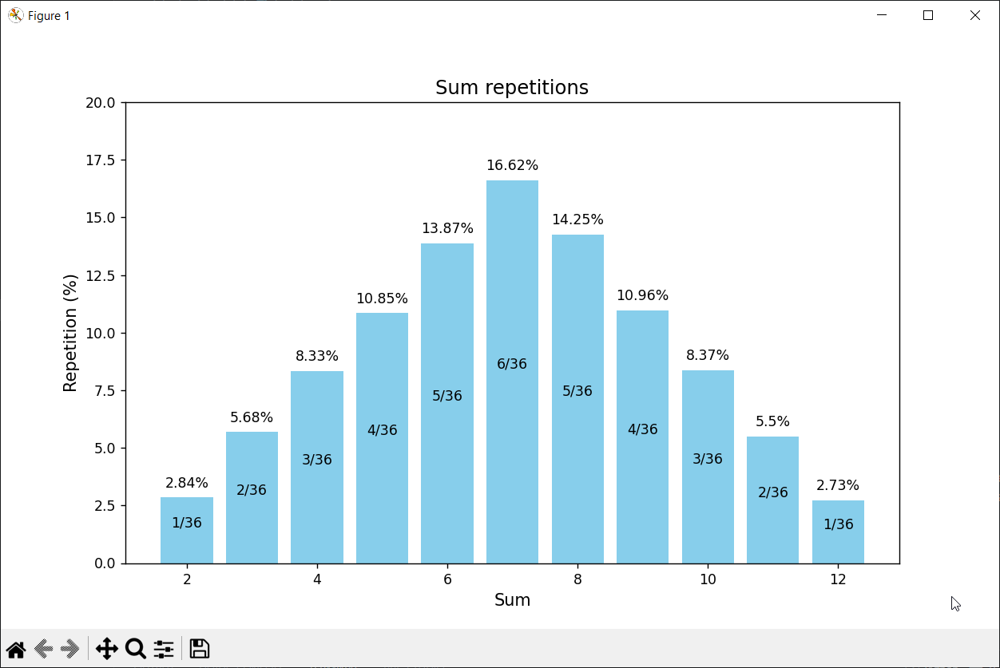

### Використання алгоритму Монте-Карло для розрахунку ймовірності кожної суми для кидків двох кубиків

 
 
 
Для перевірки результатів було згенеровано 20000 кидків кубика. Як видно, результати майже ідентичні, з невеликою похибкою
